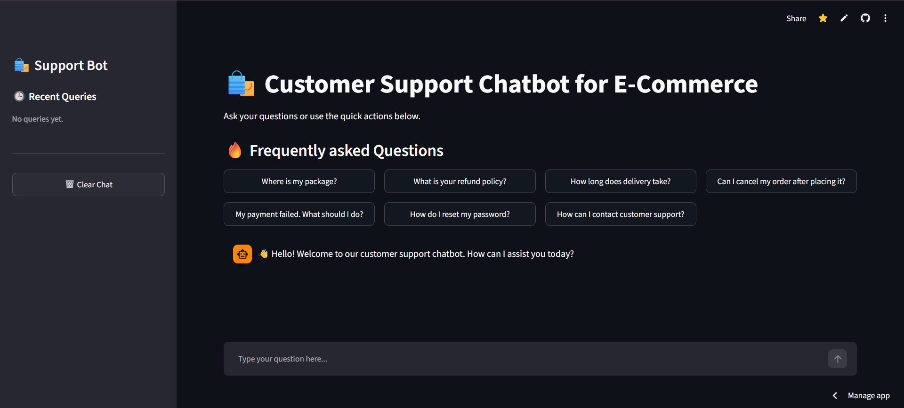
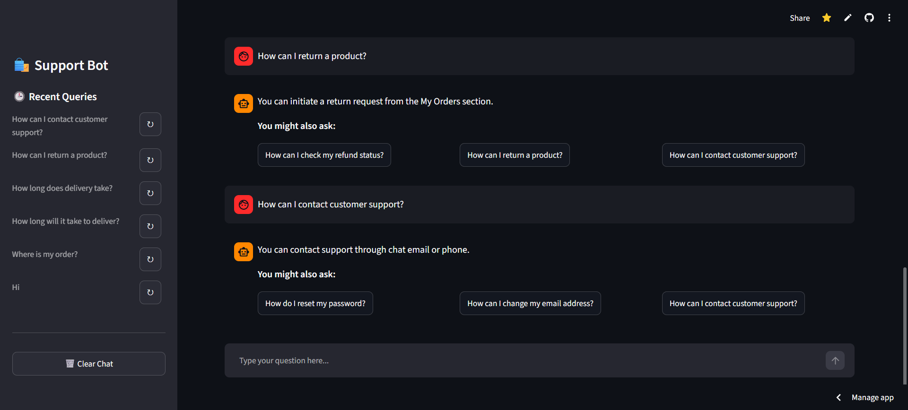

# 🛍️ Smart E-Commerce Customer Support Chatbot

## 🚀 Live Demo
Try the application here: https://customer-service-chatbot-ur29.streamlit.app/

An NLP-powered customer service chatbot designed to assist users with common e-commerce queries related to orders, shipping, refunds, payments, and account support

The chatbot uses a custom-built FAQ dataset and Natural Language Processing (NLP) techniques to understand user queries and provide the most relevant responses. It features an interactive Streamlit interface with quick-access questions, conversation history, and contextual suggestions for a seamless customer support experience

## 🚀 Features

* NLP-based query matching using TF-IDF Vectorization and Cosine Similarity
* Custom FAQ dataset containing 100+ customer support questions
* Interactive chat interface built with Streamlit
* Popular question shortcuts for quick access
* Context-aware related question suggestions
* Sidebar query history with one-click re-ask functionality
* Chat history management with Clear Chat option
* Greeting and exit message handling
* Fallback response for unknown queries

## 🧠 NLP Techniques Used

* Text Preprocessing
* TF-IDF Vectorization
* Cosine Similarity
* Confidence Threshold-Based Response Selection

## 📂 Dataset

The chatbot uses a custom-built e-commerce FAQ dataset covering:

* Orders
* Shipping
* Refunds & Returns
* Payments
* Account & Support

The dataset can be easily expanded by adding more questions and answers to the `faq_data.csv` file.

## 🛠️ Tech Stack

* Python
* Streamlit
* Pandas
* Scikit-learn
* NumPy
* Natural Language Processing (NLP)

## ▶️ How to Run Locally

### 1. Clone the Repository

```bash
git clone https://github.com/rajanv29/customer-service-chatbot
cd customer-service-chatbot
```

### 2. Install Dependencies

```bash
pip install -r requirements.txt
```

### 3. Run the Application

```bash
streamlit run app.py
```

### 4. Open in Browser

Streamlit will automatically open the application in your browser. If not, visit:
```text
http://localhost:8501
```

## 📸 Screenshots

### Home Page



### Chat Conversation



### Unknown Query Handling


## 👨‍💻 Author

Rajarajan V

If you found this project useful, feel free to star the repository and connect with me on LinkedIn.
